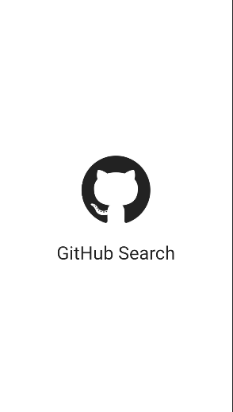
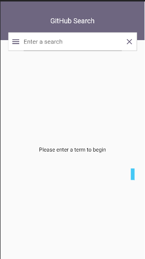

<h1>Gerenciamento de estado com BLOC.</h1>

### Screenshots v1

 
 

## Historia do projeto (branchs)

- [MAIN](https://github.com/devtvas/flutter_challenge_search-github-bloc/tree/main) - 01/07/22 - (voce esta aqui!)


<h2>Como rodar o projeto</h2>

  + Commands

    ```
    $ git clone projeto
    $ cd nome-projeto
    $ flutter build run
    ```
    
<h2>Detalhe do desafio</h2>

* ...

<h2>Requisitos de ambiente:</h2>

* Projeto já configurado para executar uma aplicação em Flutter Web.
* Configuração com a dependência de sua preferência para inversão de controle e inversão de dependência.
* Configuração com a dependência de sua preferência para gerenciamento de estado.


<h2>Detalhes de Configuracao</h2>
  
  + Flutter channel: stable 
  + Flutter: versao 3.0.2
  + Dart: versao 2.17.3
  + Design Pattern: --
  + Dependencias Utilizadas:  
    - google_fonts: 
    - splash_screen_view:
    - bloc: (new)
    - flutter_bloc: (new) 
    - http:

<h2>Referencia bibliografica</h2>

  + [LAYOUT](https://github.com/akmak1103/E-Commerce-UI-Flutter)
  + [SEARCH](https://www.kindacode.com/article/how-to-create-a-filter-search-listview-in-flutter/)
  + [BLOC](https://www.youtube.com/watch?v=UB28e59GmK8)
  + [BLOC-LIBRARY](https://bloclibrary.dev/#/flutterangulargithubsearch?id=search-bar)

## Suporte

- ...

## Candidato/Desenvolvedor

Seguem meu perfil do Linkedin, [@devtvas](https://www.linkedin.com/in/devtvas/).
